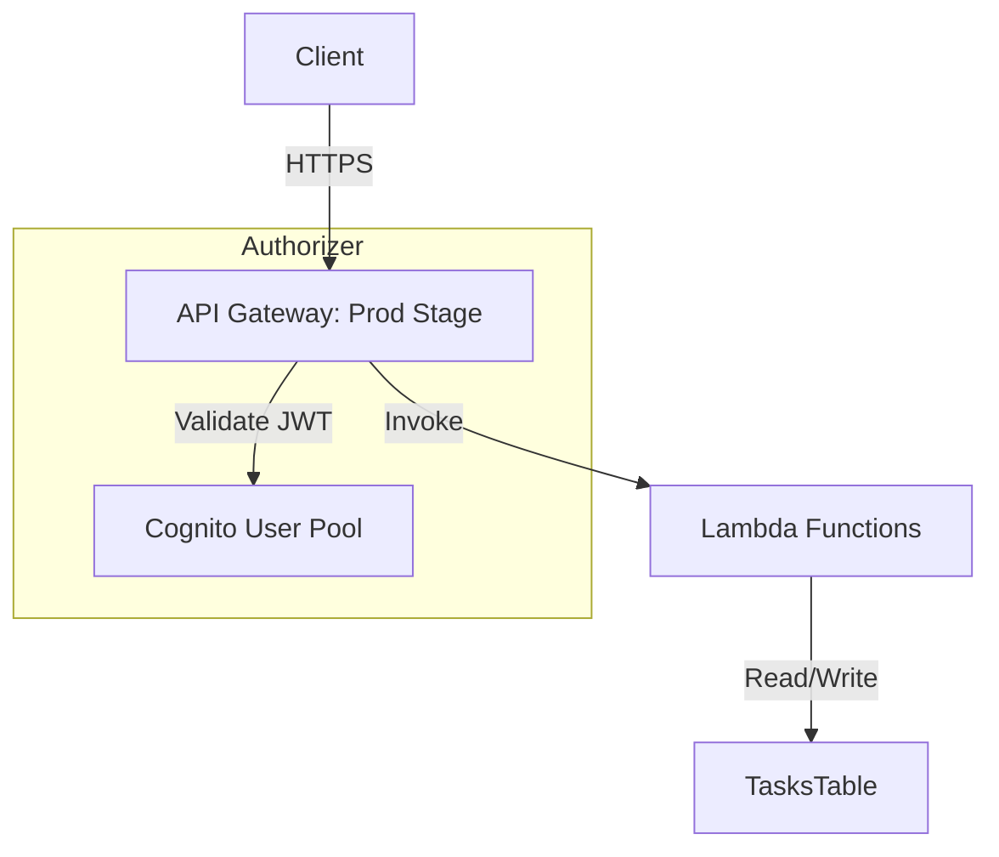

# Serverless Task Manager API

A fully‑managed, Serverless CRUD API with CI/CD, authentication, and DynamoDB persistence.

---

## 🚀 Quick Start

1. **Clone the repo**

   ```bash
   git clone https://github.com/your‑username/serverless-task-manager.git
   cd serverless-task-manager
   ```

2. **Install dependencies**

   ```bash
   npm install
   ```

3. **Configure AWS credentials**

   ```bash
   aws configure  # supply your AWS Access Key, Secret, and region (ap-south-1)
   ```

4. **Deploy the stack**

   ```bash
   sam build
   sam deploy \  # or `sam deploy --guided` once
     --stack-name serverless-task-manager-prod \
     --s3-bucket <YOUR_ARTIFACT_BUCKET> \
     --capabilities CAPABILITY_IAM \
     --region ap-south-1
   ```

5. **Retrieve outputs**
   ```bash
   export API_URL=$(aws cloudformation describe-stacks \
     --stack-name serverless-task-manager-prod \
     --region ap-south-1 \
     --query "Stacks[0].Outputs[?OutputKey=='ApiUrl'].OutputValue" \
     --output text)
   ```

---

## 📋 Endpoints

Use the `Authorization: Bearer <ID_TOKEN>` header on all calls.

| Operation         | Method | URL                         | Body                                                                           |
| ----------------- | ------ | --------------------------- | ------------------------------------------------------------------------------ |
| Create a task     | POST   | `${API_URL}/tasks`          | `{ "title": "…", "description": "…", "dueDate": "YYYY-MM-DD" }`                |
| List all tasks    | GET    | `${API_URL}/tasks`          | _(none)_                                                                       |
| Get a single task | GET    | `${API_URL}/tasks/{taskId}` | _(none)_                                                                       |
| Update a task     | PUT    | `${API_URL}/tasks/{taskId}` | `{ "title": "…", "description": "…", "dueDate": "YYYY-MM-DD", "status": "…" }` |
| Delete a task     | DELETE | `${API_URL}/tasks/{taskId}` | _(none)_                                                                       |

Example:

```bash
curl -i -X POST "$API_URL/tasks" \
  -H "Content-Type: application/json" \
  -H "Authorization: Bearer $ID_TOKEN" \
  -d '{"title":"Buy groceries","description":"Milk, bread, eggs","dueDate":"2025-05-01"}'
```

---

## 🔒 Auth Flow

We use **Amazon Cognito** for user registration, login, and JWT issuance.

1. **Sign up** a new user:

   ```bash
   aws cognito-idp sign-up \
     --client-id $COGNITO_CLIENT_ID \
     --username user@example.com \
     --password P@ssw0rd \
     --user-attributes Name=email,Value=user@example.com
   ```

2. **Confirm** the user (admin action):

   ```bash
   aws cognito-idp admin-confirm-sign-up \
     --user-pool-id $COGNITO_USER_POOL_ID \
     --username user@example.com
   ```

3. **Authenticate** to get an ID token:

   ```bash
   export ID_TOKEN=$(aws cognito-idp initiate-auth \
     --auth-flow USER_PASSWORD_AUTH \
     --client-id $COGNITO_CLIENT_ID \
     --auth-parameters USERNAME=user@example.com,PASSWORD=P@ssw0rd \
     --query "AuthenticationResult.IdToken" --output text)
   ```

4. **Use** the `ID_TOKEN` in your `Authorization` header to call the API.

---

## 🏗️ Architecture Diagram



---

## 📚 Further Reading

- [AWS SAM Developer Guide](https://docs.aws.amazon.com/serverless-application-model/latest/developerguide/)
- [Amazon Cognito Docs](https://docs.aws.amazon.com/cognito/latest/developerguide/)
- [DynamoDB Best Practices](https://docs.aws.amazon.com/amazondynamodb/latest/developerguide/best-practices.html)

---

© 2025 Serverless Task Manager Project
